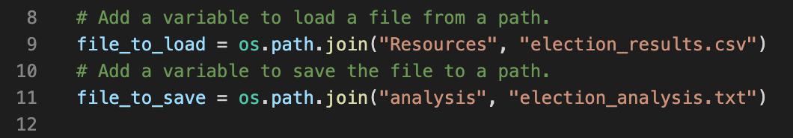
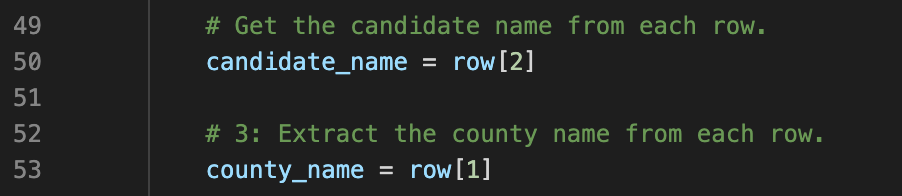

# Election Analysis
## Overview of Election Audit:
The purpose of this analysis is to summarize the results of the congressional election, providing insight into the quantity of votes for each candidate and the level of participation within each county. 

## Election-Audit Results: 

- **Total Votes Cast:** 369,711 
- **County Participation:** Below is a breakdown of the number of votes and the percentage of total votes for each county in the precinct.
  - Jefferson County:  10.5% (38,855 votes)
  - Denver County:  82.8% (306,055 votes)
  - Arapahoe County:  6.7% (24,801 votes)
- **Largest County Turnout:** Denver County had the greatest turnout at the election with a total count of 306,055 votes cast.
- **Election Results:** Below is a breakdown of the number of votes and the percentage of the total votes each candidate received.
  - Charles Casper Stockham: 23.0% (85,213 votes)
  - Diana DeGette: 73.8% (272,892 votes)
  - Raymon Anthony Doane: 3.1% (11,606 votes)
- **Winning Candidate:** Diana DeGette won the election, receiving 272,892 votes (73.8% of all votes).

## Election-Audit Summary: 
With only a few simple modifications, this script can be used to analyze future elections as well.
1. First, adjust the file path on lines 9 to match the path of the csv file containing the new election data. Adjust the file path on line 11 to match the path of the txt file where you would like to save your results.

2. Next, verify that the number listed within the brackets on line 50 reflects the number of the column containing candidate names in your new election results csv. Also, verify that the number listed within the brackets on line 50 reflects the number of the column containing county names in your new election results csv.
**NOTE:** The first column in your spreadsheet is considered column 0, the second column is considered column 1, and so on...

